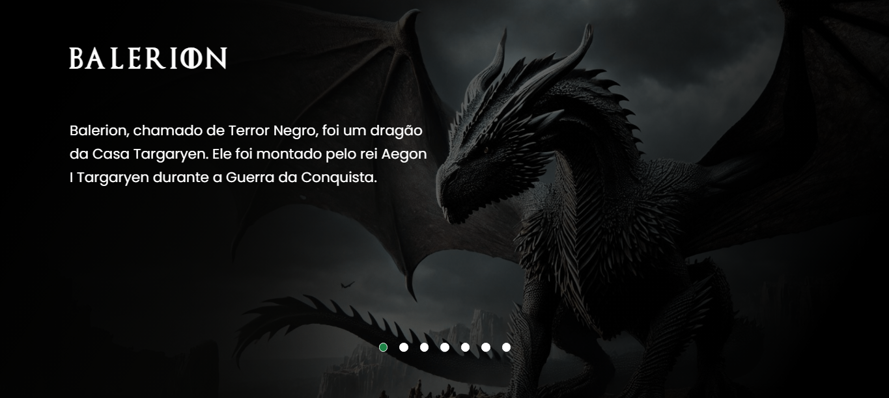

<h1 align="center">
 Landing Page House Of The Dragon
</h1>

  

/

## 💻 Projeto

Este projeto é o resultado de uma semana de aula realizada pelo canal do YouTube Dev em Dobro, onde ele propõe uma nova landing page com o tema da série House Of The Dragon. Durante a aula, utilizamos técnicas de HTML, CSS, JavaScrips e técnicas de resposividade.

## 🚀 Tecnologias

- HTML
- CSS
- JavaScript
- Técnicas de Resposividade

## 📔 Conhecimentos abordados

- [x] Uso semântico do HTML;

